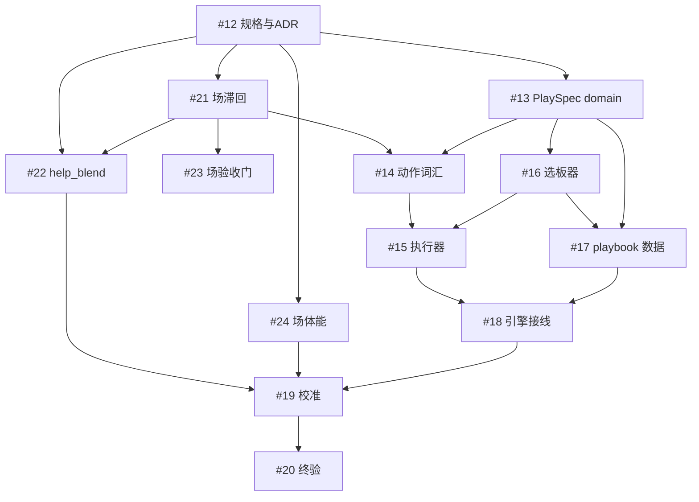

# Play 战术系统与势能场优化 · 执行编排

> 周期：20260917_first_principles_next 的延伸计划（play 系统 + 场优化）。
> 本文件是执行编排视图：串行链、并行波次、subagent 分派与验收纪律。
> 任务语义以 todo 系统为准（#12–#24）；本文不复述实现细节，只管顺序与分派。

## 阶段 0 · 规格与裁定（串行，无并行可能）

| 任务 | 内容 | 执行者 |
| --- | --- | --- |
| #12 | tactics.md 补 play 规则模型语义（rules/carrier_preferences/inhibitions、谓词词汇表含场输出消费、System\|Play 两级 kind、选板触发语义、场侧滞回为谓词的前提条款）+ ADR 登记 | 主 agent（规格裁定需要全局一致性判断，不下放） |

**为什么必须先做**：规格 face 决定语义，实现跟随（charter/README 治理）；#13/#21/#22/#24 全部从 #12 的裁定文本取义，不依赖其代码。

## 阶段 1 · 三条独立链并行（subagent 分派）

#12 完成后，三条链的改动面**零交集**，可同时开工：

| 链 | 任务 | 主要文件 | subagent 分派 |
| --- | --- | --- | --- |
| A · domain 数据层 | #13 PlaySpec/规则集 schema + 校验器 + 单测 | crates/domain/src/tactics.rs、新文件、domain tests | subagent-a（domain 单 crate，改动面独立） |
| B · 场优化 | #21 滞回 → 完成后 #22 help_blend、#24 体能衰减（22/24 互不相干可再并行）、#23 验收门 | crates/decision/src/potential_field.rs、rules/policies.rs、defense_responsibility_chain.rs、engine state.rs | subagent-b（先做 #21，完成后回到 #22/#24 并行分派或顺序执行，#23 最后锁行为） |

链 A 与链 B 互不接触对方文件；冲突风险只在 Cargo.toml（无新依赖，不会碰）与 golden_hash.rs（双方都触发行为变更登记——**约定**：链 B 的哈希条目在 #21/#22/#24 各自完成时逐个登记，链 A 在 #17 数据接入时登记，条目按完成时间顺序追加，无冲突）。

**wave 内的调度**：subagent 数量不设固定上限——subagent 本身是 LLM 会话，主要消耗 API 吞吐；真正的本地约束是它们引发的 cargo 编译/测试负载。分派按改动 crate 的编译面评估：重编译面（engine/physics）同波至多一个，轻面（domain/decision 纯数据与纯函数）可多路并行；有真实竞争的是 cargo 文件锁（同 workspace 并行 cargo 会串行等锁，本地收益在 LLM 思考与构建重叠的那段）与内存（3.7 GB，tier3 全场测试单进程数百 MB）。纪律：轻验证（check/clippy/小单测）多路并行不限；重测试（stats_baseline、16-seed 矩阵、黄金哈希、全场模拟类）全局串行独占，任何时刻至多一个；同一 crate 的改动串行。

**分派纪律**（每个 subagent 的 prompt 必须自带）：
- 全部上下文自带：任务描述 + 对应规格文本（#12 产出）+ 仓库硬约束（无 heredoc 改码、edit 工具、中文注释、fast-fail、禁 mock）；
- 边界明确：只动列出的文件；golden_hash 登记条目只允许链内追加，禁止改他人条目；
- 交付物：cargo check/clippy -p 全绿 + 各自单测绿 + 行为摘要（哪个系数/签名变了，供 #19 汇总）。

## 阶段 2 · 汇聚层（链 A 完成、链 B 完成后）

| 任务 | 依赖 | 执行者 | 并行性 |
| --- | --- | --- | --- |
| #14 交互动作词汇 | #13 + #21（谓词契约就绪） | subagent-c（物理+动作窗口，改动面 engine/physics） | 与 #16 并行 |
| #16 选板器 | #13 | subagent-d（decision 层纯函数 + 单测） | 与 #14 并行（文件不交集） |

#14 内部串行（动词实现相互引用）；#16 独立。两者完成前 #15 无法开工（执行器要消费动词与选板产出）。

## 阶段 3 · 执行器与数据（串行为主）

| 任务 | 依赖 | 执行者 |
| --- | --- | --- |
| #15 执行器（每 tick 规则评估层） | #13, #14 | 主 agent 或 subagent（评估层骨架需要跨 #14/#16 的接口判断，主 agent 亲自做更稳） |
| #17 样例 playbook 数据 | #13, #15, #16 | subagent-e（纯数据 + 档案校验，可由 #16 的 subagent 顺延执行） |

#15 与 #17 有弱并行空间：#17 的档案 JSON 可先写、以校验器（#13 产物）验证合法性，执行器接入后跑通触发链。若 #15 由主 agent 亲自做，#17 并行交给 subagent。

## 阶段 4 · 接线与校准（串行，主 agent）

| 任务 | 内容 |
| --- | --- |
| #18 引擎接线与可观测性 | tactics_phase 消费规则评估输出、stream/UI 暴露 play id 与规则命中、守卫脚本进 CI。涉及跨模块接缝与黄金哈希窗口判断，主 agent 亲自做 |
| #19 行为校准 | 汇总链 B（#21/#22/#24）与链 A（#17）全部行为变更：指纹（选板分布、规则触发链、场标签稳定率、轮转因果链）+ 8-seed 统计 + 16-seed 矩阵 + 黄金哈希登记 + 棘轮同步。校准必须看全局，不下放 |
| #20 终验与文档同步 | 全套件 + clippy + 八守卫 + 矩阵 + 文档（tactics/architecture/status/plan/ADR）。主 agent |

## 依赖图（mermaid）

## 并行波次总览（数量按编译面评估，轻验证多路并行，重测试全局串行）

- **W0**（串行）：#12 —— 主 agent
- **W1**：subagent-a 做 #13 ‖ subagent-b 做 #21（→ 完成后 b 接 #22 → #24 → #23）
- **W2**：#13 完成后：subagent-c 做 #14（需 #21 已完成）‖ subagent-d 做 #16
- **W3**：#14/#16 完成：主 agent 做 #15 ‖ subagent-e 做 #17
- **W4**（串行）：#18 主 agent → #19 主 agent → #20 主 agent

## 风险与对策

- **构建/测试资源争用**：按编译面分派（重面同波至多一链）；重测试全局串行独占；全量套件（#19/#20）永远独占运行。
- **黄金哈希条目冲突**：行为变更条目按完成顺序追加登记，各链只写自己的条目；#19 做终态核对（账本条目与常量一一对应）。
- **subagent 产出质量**：每个 subagent 交付后主 agent 用 diff 核对改动面与边界（trust but verify），链 B 的数学改动（#21/#22）主 agent 逐行复核。
- **规格返工**：若 #13/#14 实现中发现规格缺口，回 #12 补文本再继续，禁止实现侧私自定语义。
